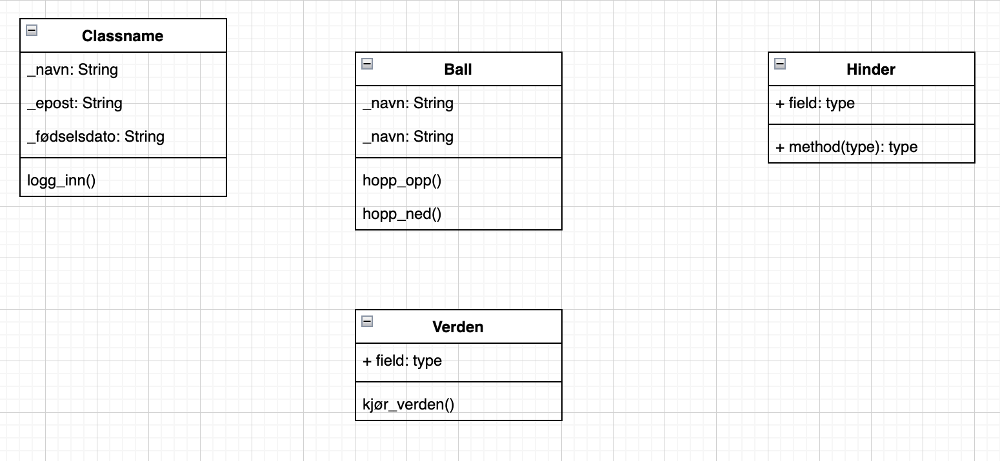
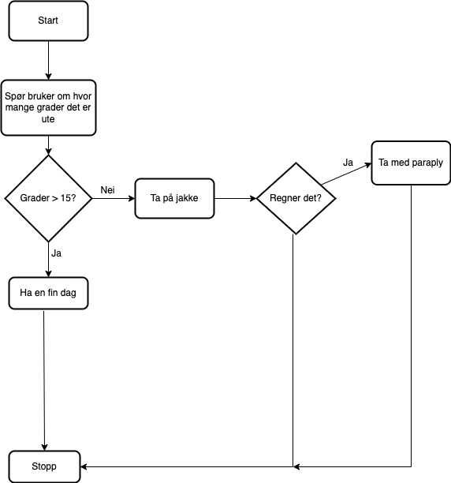
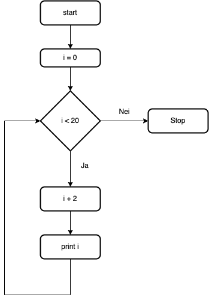

# Modellering

Modellering i Python refererer vanligvis til å bygge matematiske eller statistiske modeller ved hjelp av Python-programmeringsspråket. Python har en rekke biblioteker og moduler som kan brukes til å utføre ulike typer modellering, inkludert maskinlæring, dataanalyse, numerisk beregning og simulering.

For eksempel kan man bruke diagrams.net for å lage UML-diagrammer:




## Eksperttips: Man kan også lage flytdiagrammer

Dette er et flytdiagram til denne koden:


```python
grader = int(input("Hvor mange grader er det ute?: "))

if grader > 15:
    print("Ha en fin dag i varmen!")
else:
    print("Ta på jakke")
    type = input("Regner det? ")
    if type.lower == "ja":
        print("Ta med paraply")
```



Dette er et flytdiagram til denne koden:

```python
i = 0
while i < 20:
    i += 2
    print(i)
```



